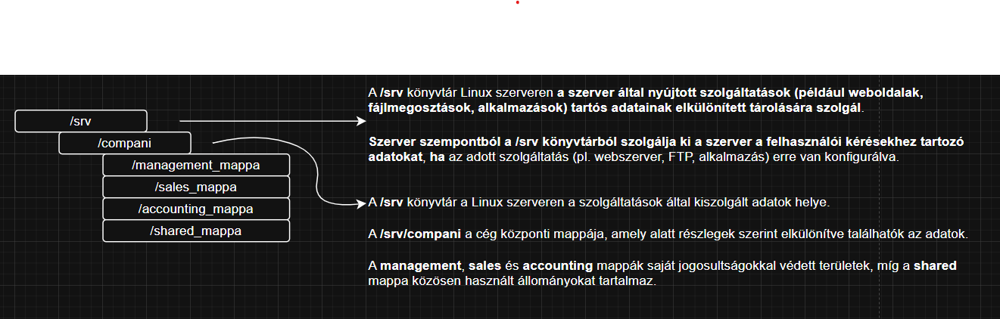
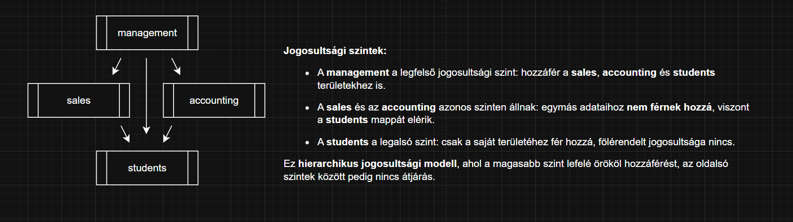
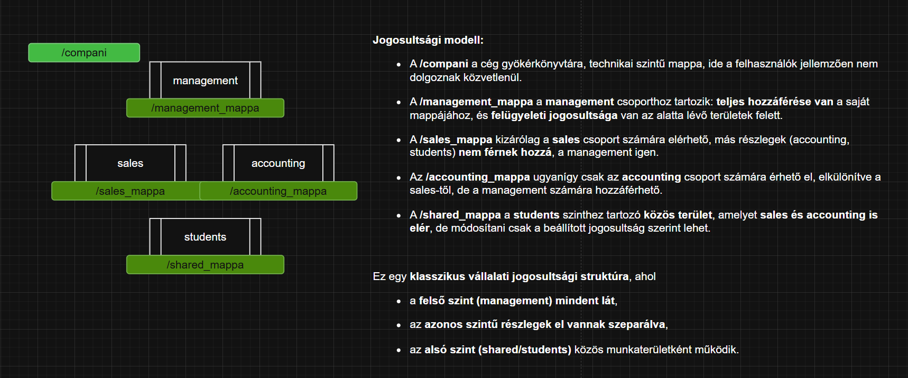
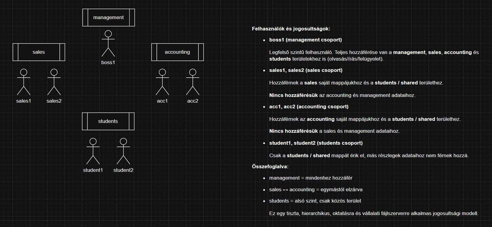

Ebben a tananyagban egy Linux szerveren kialakított felhasználói és jogosultsági rendszerrel foglalkozunk. A bemutatott rendszer egy többfelhasználós fájlszerver működését írja le, ahol az egyes felhasználók eltérő szerepkörök szerint, eltérő hozzáférési jogokkal dolgoznak.

A gyakorlat során egy teljes jogosultsági modellt építünk fel, amelyben minden hozzáférés tudatos döntés eredménye. A cél egy olyan szerkezet kialakítása, amely egyszerre biztosít elkülönítést és együttműködést.

---

## A fájlszerver logikai felépítése

A szerveren az adatok egy központi könyvtár alatt helyezkednek el. Ez a könyvtár tartalmazza a teljes szervezeti struktúrát, amelyen belül külön könyvtárak tartoznak az egyes szerepkörökhöz. Minden könyvtár egy adott csoport munkaterületét jelöli.

A könyvtárak elhelyezése a jogosultsági modell része. Egy felhasználó csak azokhoz a könyvtárakhoz férhet hozzá, amelyek megfelelnek a szerepkörének.

---

## Szerepkörök a rendszerben

A modell négy elkülönülő szerepkörrel dolgozik, amelyek különböző jogosultsági szinteket képviselnek.

A management szerepkör felügyeleti jogosultságot jelent. Az ide tartozó felhasználók minden könyvtárhoz hozzáférnek.

A sales és az accounting szerepkörök azonos jogosultsági szinten helyezkednek el. Mindkét csoport kizárólag a saját munkaterületét használja, ugyanakkor mindkét csoport számára elérhető egy közösen használt könyvtár.

A students szerepkör korlátozott hozzáféréssel rendelkezik. Az ide tartozó felhasználók kizárólag a közös munkaterületet érhetik el.

---

## Jogosultsági szintek kapcsolata

A jogosultságok hierarchikusan épülnek fel. A magasabb jogosultsági szint minden alacsonyabb szintű hozzáférést megkap, míg az azonos szinten lévő szerepkörök egymástól el vannak választva.

A közös könyvtár olyan terület, amelyhez több csoport is hozzáfér, de kizárólag ezen a ponton történik együttműködés.

---

## Felhasználók és csoporttagság a rendszerben

Az ábra a rendszerben létrehozott felhasználókat és azok csoporttagságát mutatja be. A Linux jogosultságkezelésének alapelve szerint a hozzáférések nem közvetlenül a felhasználókhoz, hanem **csoportokon keresztül** vannak meghatározva. Ezért a felhasználók szerepe a rendszerben elsősorban a csoporttagságuk alapján értelmezhető.

A **boss1** felhasználó a *management* csoport tagja. Ez a felhasználó vezetői szerepkört tölt be, ezért a rendszer legmagasabb jogosultsági szintjén helyezkedik el. A management csoporthoz tartozó felhasználó felügyeleti jogosultságokkal rendelkezik, vagyis nem egyetlen részleghez kötődik, hanem a teljes rendszer működését képes ellenőrizni.

A **sales1** és **sales2** felhasználók a *sales* csoport tagjai. Ők az értékesítési részleg felhasználói, akik azonos jogosultsági szinten helyezkednek el egymással. A sales csoportba tartozás azt jelenti, hogy ezek a felhasználók kizárólag az értékesítéshez kapcsolódó adatokkal dolgoznak, és nem rendelkeznek hozzáféréssel más részlegek adataihoz.

Az **acc1** és **acc2** felhasználók az *accounting* csoporthoz tartoznak. Ők a könyvelési részleg felhasználói, és jogosultságaik megegyeznek egymással, ugyanakkor elkülönülnek a sales csoport felhasználóitól. Az accounting csoport tagjai nem férnek hozzá az értékesítés adataihoz, és fordítva.

A **student1** és **student2** felhasználók a *students* csoport tagjai. Ez a csoport a legalacsonyabb jogosultsági szintet képviseli. A students csoporthoz tartozó felhasználók nem rendelkeznek részlegspecifikus jogosultságokkal, szerepük kifejezetten korlátozott.

A felhasználók elhelyezkedése az ábrán azt szemlélteti, hogy az egyes csoportok **hierarchikusan rendeződnek**, ugyanakkor az azonos szinten lévő felhasználók között nincs alá-fölérendeltségi viszony. A jogosultságok nem az egyes felhasználók egyéni döntésein múlnak, hanem kizárólag azon, hogy mely csoporthoz tartoznak.

Ez a felépítés biztosítja, hogy a rendszer könnyen bővíthető legyen: új felhasználó létrehozásakor elegendő a megfelelő csoporthoz rendelni, és a jogosultságok automatikusan érvényesülnek.

---

A tananyag további részében ezt a jogosultsági modellt Linux parancsok segítségével hozzuk létre. A könyvtárstruktúrát fizikailag felépítjük, a felhasználókat és csoportokat létrehozzuk, majd beállítjuk a szükséges jogosultságokat.

A beállítások után minden szerepkört valós felhasználóval tesztelünk.

